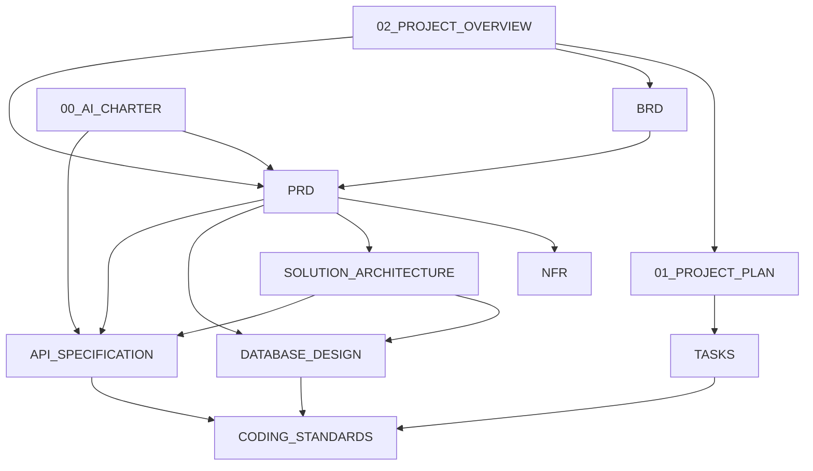

# Knowledge Base - AI Property Website MVP

## Project Overview
This repository contains the documentation for the AI Property Website MVP, a full-stack property listing platform with AI-powered chatbot assistance. The platform enables users to browse, search, and manage property listings, while administrators can manage properties and system configurations.

Key features:
- Public property browsing and search with filtering
- User authentication (registration, login, logout, admin roles)
- AI chatbot for property queries and assistance (using Anthropic Claude API)
- Admin dashboard for property CRUD operations, publish/unpublish controls
- Tech stack: Next.js/React frontend, Node.js/Express backend, Prisma ORM, PostgreSQL database, OpenStreetMap + Leaflet.js for maps

## Documentation Structure
All core project documentation is centralized in this `knowledge_base` directory for easy reference and maintenance.

```
knowledge_base/
├── 00_AI_CHARTER.md                 # AI usage guidelines and principles
├── 01_PROJECT_PLAN.md               # Implementation roadmap and timelines
├── 02_PROJECT_OVERVIEW.md           # High-level project summary and objectives
├── API_SPECIFICATION.md             # REST API contracts and endpoints
├── BRD.md                           # Business Requirements Document
├── CODING_STANDARDS.md              # Development guidelines and best practices
├── DATABASE_DESIGN.md               # Database schema and relationships
├── NFR.md                           # Non-functional requirements (performance, security, etc.)
├── PRD.md                           # Product Requirements Document
├── REVIEW_SUMMARY.md                # Executive summary of project review
├── SOLUTION_ARCHITECTURE.md      # System Design
├── SOLUTION_ARCHITECTURE.md                 SOLUTION_ARCHITECTURE.md          # System architecture overview
├── TASKS.md                         # Detailed task breakdown with dependencies
```

## Folder Descriptions
- **knowledge_base/**
  - Single flat directory containing all essential project documentation files.
  - No subfolders; each file serves a distinct purpose in the project lifecycle.

## Document Dependency Map


## Reading Order for Developers and AI Agents
1. **02_PROJECT_OVERVIEW.md** - Start here to understand the project vision and scope.
2. **01_PROJECT_PLAN.md** - Review implementation phases and timelines.
3. **BRD.md** - Understand business goals and stakeholder requirements.
4. **PRD.md** - Detailed feature specifications and user stories.
5. **NFR.md** - System qualities: performance, security, scalability, usability.
6. **SOLUTION_ARCHITECTURE.md** - High-level system design and component interactions.
7. **DATABASE_DESIGN.md** - Data modeling, schema, and relationships.
8. **API_SPECIFICATION.md** - Contract details for frontend-backend communication.
9. **CODING_STANDARDS.md** - Guidelines for writing maintainable, consistent code.
10. **00_AI_CHARTER.md** - Principles for AI usage, ethics, and prompt engineering.
11. **REVIEW_SUMMARY.md** - Executive summary for quick stakeholder updates.
12. **TASKS.md** - Granular work breakdown for execution tracking (reference during development).

## Links to Every Document
-every document_00_AI_CHARTER.md](./00_AI_CHARTER.md)
- document_01_PROJECT_PLAN.md](./01_PROJECT_PLAN.md)
- document_02_PROJECT_OVERVIEW.md](./02_PROJECT_OVERVIEW.md)
- document_API_SPECIFICATION.md](./API_SPECIFICATION.md)
- document_BRD.md](./BRD.md)
- document_CODING_STANDARDS.md](./CODING_STANDARDS.md)
- document_DATABASE_DESIGN.md](./DATABASE_DESIGN.md)
- document_NFR.md](./NFR.md)
- document_PRD.md](./PRD.md)
- document_REVIEW_SUMMARY.md](./REVIEW_SUMMARY.md)
- document_SOLUTION_ARCHITECTURE.md](./SOLUTION_ARCHITECTURE.md)
- document_TASKS.md](./TASKS.md)

## Source of Truth Policy
- The `knowledge_base/` directory is the **single source of truth** for all project documentation.
- Any updates to project requirements, architecture, API contracts, or standards must be made directly to the relevant files in this directory.
- Duplicate documentation elsewhere in the repository (e.g., in `raw_documents/` or individual component folders) should be considered outdated or illustrative only.
- Before implementing changes, consult the latest version of the applicable document(s) in `knowledge_base/`.

## Versioning Policy
- Each document in `knowledge_base/` should maintain its own version history via Git commits.
- Use descriptive commit messages that reference the document name and nature of change (e.g., "Update API_SPECIFICATION.md: add pagination endpoint").
- Major version increments (e.g., v1.0 → v2.0) are reserved for substantive changes that affect API contracts, database schema, or core user flows.
- Minor version increments (e.g., v1.0 → v1.1) apply to clarifications, additions, or non-breaking adjustments.
- Tags may be used to mark releases (e.g., `v1.0-release`) aligned with milestones in `01_PROJECT_PLAN.md`.

## Change Management Process
1. **Propose Changes**
   - Create an issue describing the proposed change, its rationale, and impact.
   - Tag relevant stakeholders (product, architecture, engineering).
2. **Review**
   - Assign reviewers based on document ownership:
     - BRD/PRD: Product Lead
     - NFR: Architecture Lead
     - SOLUTION_ARCHITECTURE: System Architect
     - DATABASE_DESIGN: Database Administrator
     - API_SPECIFICATION: Backend Lead
     - CODING_STANDARDS: Engineering Manager
     - 00_AI_CHARTER: AI Ethics Officer
   - Reviewers must verify consistency with related documents.
3. **Approval**
   - Changes require approval from at least two reviewers, including the domain expert.
   - For API or database changes, additional approval from DevOps/QA is recommended.
4. **Implementation**
   - Once approved, edit the document directly in `knowledge_base/`.
   - Commit changes with a clear message and push to the main branch.
   - Update any dependent documents if needed (e.g., API change may require updates to PRD or TASKS).
5. **Communication**
   - Announce changes in the project communication channel (e.g., Slack #project-updates).
   - Update the `REVIEW_SUMMARY.md` if the change affects project scope or timeline.
   - Ensure AI agents are re-indexed on the updated documentation if using retrieval-augmented generation.

---
*Last updated: 2026-07-23*
*Maintained by: Project Documentation Team*