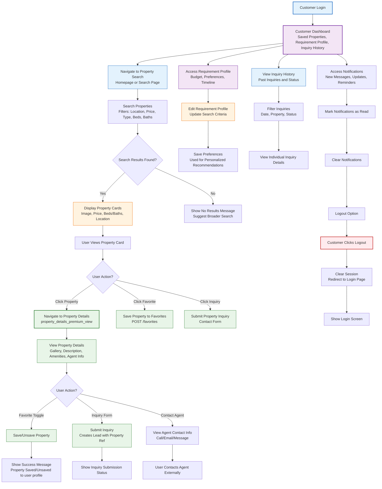
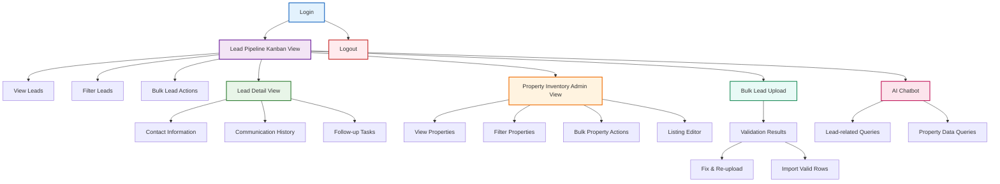
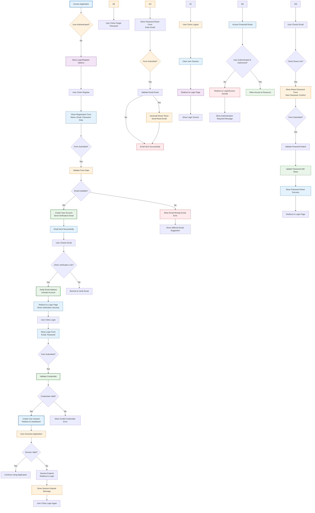

# User Flows

This document contains the complete user journey documentation for the Property Vista CRM MVP, covering all major user flows with detailed descriptions and Mermaid flowchart diagrams.

## 1. Customer Flow

### Description
The customer flow describes the journey of an authenticated customer (registered user) in the Property Vista CRM MVP. Customers can search for properties, save favorites, view property details, submit inquiries, manage their requirement profile, and review their inquiry history. This flow focuses on the customer-facing features that enhance the property search and engagement experience beyond what's available to anonymous visitors.

### Mermaid Flowchart


## 2. Admin Flow

### Description
The admin flow represents the workflow for system administrators in the Property Vista CRM MVP. Administrators have full access to all system features including property management (CRUD operations, publishing/unpublishing), lead management, user management (agents and customers), AI chatbot configuration, and system settings. This flow covers the administrative tasks required to maintain and operate the CRM system.

### Mermaid Flowchart


```mermaid
flowchart TD
    A[Admin Login] --> B[Admin Dashboard<br/>System Overview, Key Metrics]
    B --> C[Navigate to Property Management]
    C --> D[View Property List<br/>Table with Search/Filters]
    D --> E{Property Action?}
    E -->|View Details| F[Open Property Detail View]
    E -->|Edit Property| G[Open Property Edit Form<br/>All Property Fields]
    E -->|Delete Property| H[Confirm Property Deletion]
    E -->|Publish/Unpublish| I[Toggle Publication Status]
    E -->|Bulk Actions| J[Select Multiple Properties<br/>Publish/Unpublish/Delete]
    F --> K[View Property Details<br/>Gallery, Specs, Agent, Status]
    G --> L[Edit Property Form<br/>Save Changes]
    L --> M[Show Update Success/Error]
    H --> N[Confirm Deletion<br/>Type CONFIRM to Delete]
    N --> O[Process Deletion<br/>Show Result]
    I --> P[Update Publication Status<br/>Show Success Message]
    J --> Q[Process Bulk Action<br/>Show Results Summary]
    B --> R[Navigate to Lead Management]
    R --> S[View Lead Pipeline<br/>Kanban: New→Contacted→Site Visit→Negotiation→Closed]
    S --> T{Drag & Drop Lead?}
    T -->|Yes| U[Move Lead to New Stage<br/>Update Stage Automatically]
    T -->|No| V[Click Lead Card<br/>Open Lead Detail View]
    V --> W[View Lead Details<br/>Contact Info, History, Property Ref]
    W --> X{Lead Action?}
    X -->|Add Note| Y[Add Communication Note]
    X -->|Schedule Visit| Z[Open Visit Scheduling<br/>Date/Time/Agent]
    X -->|Add Task| AA[Create Follow-up Task]
    X -->|Change Stage| AB[Move to Different Pipeline Stage]
    B --> AC[Navigate to User Management]
    AC --> AD[View Users List<br/>Agents and Customers]
    AD --> AE{User Action?}
    AE -->|View Details| AF[View User Profile]
    AE -->|Edit Role| AG[Change User Role<br/>Customer/Agent/Admin]
    AE -->|Reset Password| AH[Generate Temporary Password]
    AE -->|Deactivate| AI[Deactivate User Account]
    AF --> AJ[Edit User Profile<br/>Name, Email, Contact Info]
    AJ --> AK[Save Changes<br/>Show Success Message]
    AL --> AM[Bulk User Actions<br/>Activate/Deactivate/Role Change]
    B --> AN[Navigate to AI Configuration]
    AN --> AO[Configure AI Settings<br/>Model Parameters, Temperature]
    AO --> AP[Test AI Connection<br/>Send Test Query]
    AP --> AQ[View Test Results<br/>Response Quality, Speed]
    AR --> AS[View AI Usage Statistics<br/>Tokens Used, Response Times]
    B --> AT[Navigate to System Settings]
    AT --> AU[General Settings<br/>App Name, Contact Info, Timezone]
    AU --> AV[Email Settings<br/>SMTP Configuration, Templates]
    AV --> AW[Payment Settings<br/>Gateway Configuration]
    AW --> AX[Map Settings<br/>Default Location, API Keys]
    AX --> AY[Security Settings<br/>Session Timeout, Password Policy]
    AY --> AZ[Backup & Restore<br/>Database Backup Options]
    BA --> BB[System Monitoring<br/>Usage Analytics, Error Logs]
    BC --> BD[Audit Trail<br/>User Actions, Data Changes]
    BE --> BF[Logout Option]
    BF --> BG[Admin Clicks Logout]
    BG --> BH[Clear Admin Session]
    BH --> BI[Redirect to Login Page]
    BI --> BJ[Show Login Screen]
    
    %% Styling
    style A fill:#e3f2fd,stroke:#1565c0,stroke-width:2px
    style BJ fill:#ffebee,stroke:#c62828,stroke-width:2px
    style B fill:#f3e5f5,stroke:#6a1b9a,stroke-width:2px
    style D fill:#e3f2fd,stroke:#1565c0,stroke-width:1px
    style F fill:#fff3e0,stroke:#ef6c00,stroke-width:1px
    style G fill:#fff3e0,stroke:#ef6c00,stroke-width:1px
    style H fill:#ffebee,stroke:#c62828,stroke-weight:1px
    style I fill:#e8f5e8,stroke:#2e7d32,stroke-weight:1px
    style J fill:#fff3e0,stroke:#ef6c00,stroke-weight:1px
    style S fill:#e3f2fd,stroke:#1565c0,stroke-weight:1px
    style U fill:#e8f5e8,stroke:#2e7d32,stroke-weight:2px
    style V fill:#fff3e0,stroke:#ef6c00,stroke-weight:1px
    style W fill:#e3f2fd,stroke:#1565c0,stroke-weight:1px
    style X fill:#fff3e0,stroke:#ef6c00,stroke-weight:1px
    style Y fill:#e8f5e8,stroke:#2e7d32,stroke-weight:1px
    style Z fill:#fff3e0,stroke:#ef6c00,stroke-weight:1px
    style AA fill:#fff3e0,stroke:#ef6c00,stroke-weight:1px
    style AB fill:#e8f5e8,stroke:#2e7d32,stroke-weight:2px
    style AC fill:#e3f2fd,stroke:#1565c0,stroke-weight:1px
    style AD fill:#e3f2fd,stroke:#1565c0,stroke-weight:1px
    style AE fill:#f3e5f5,stroke:#6a1b9a,stroke-weight:1px
    style AF fill:#fff3e0,stroke:#ef6c00,stroke-weight:1px
    style AG fill:#fff3e0,stroke:#ef6c00,stroke-weight:1px
    style AH fill:#fff3e0,stroke:#ef6c00,stroke-weight:1px
    style AI fill:#fff3e0,stroke:#ef6c00,stroke-weight:1px
    style AJ fill:#fff3e0,stroke:#ef6c00,stroke-weight:1px
    style AK fill:#e8f5e8,stroke:#2e7d32,stroke-weight:2px
    style AL fill:#f3e5f5,stroke:#6a1b9a,stroke-weight:1px
    style AM fill:#e8f5e8,stroke:#2e7d32,stroke-weight:2px
    style AN fill:#f3e5f5,stroke:#6a1b9a,stroke-weight:1px
    style AO fill:#fff3e0,stroke:#ef6c00,stroke-weight:1px
    style AP fill:#e8f5e8,stroke:#2e7d32,stroke-weight:2px
    style AQ fill:#e3f2fd,stroke:#1565c0,stroke-weight:1px
    style AR fill:#fff3e0,stroke:#ef6c00,stroke-weight:1px
    style AS fill:#e8f5e8,stroke:#2e7d32,stroke-weight:2px
    style AT fill:#f3e5f5,stroke:#6a1b9a,stroke-weight:1px
    style AU fill:#fff3e0,stroke:#ef6c00,stroke-weight:1px
    style AV fill:#fff3e0,stroke:#ef6c00,stroke-weight:1px
    style AW fill:#fff3e0,stroke:#ef6c00,stroke-weight:1px
    style AX fill:#fff3e0,stroke:#ef6c00,stroke-weight:1px
    style AY fill:#fff3e0,stroke:#ef6c00,stroke-weight:1px
    style AZ fill:#e8f5e8,stroke:#2e7d32,stroke-weight:2px
    style BA fill:#f3e5f5,stroke:#6a1b9a,stroke-weight:1px
    style BB fill:#e8f5e8,stroke:#2e7d32,stroke-weight:2px
    style BC fill:#f3e5f5,stroke:#6a1b9a,stroke-weight:1px
    style BD fill:#e8f5e8,stroke:#2e7d32,stroke-weight:2px
    style BE fill:#f3e5f5,stroke:#6a1b9a,stroke-weight:1px
    style BF fill:#fff3e0,stroke:#ef6c00,stroke-weight:1px
```

## 3. Agent Flow

### Description
The agent flow begins with login, leading to the lead pipeline Kanban view where agents can view, filter, and perform bulk actions on leads. From the pipeline, agents can navigate to individual lead detail views to examine contact information, communication history, and follow-up tasks. Agents can also manage property listings through the property inventory view and listing editor, and if permitted, conduct bulk lead uploads and review validation results. Throughout the workflow, agents can utilize the AI chatbot for lead-related queries and suggestions. The flow concludes with logout.

### Mermaid Flowchart


## 4. Authentication Flow

### Description
The authentication flow covers user registration, login, logout, password reset, session management, and access control in the Property Vista CRM MVP. It handles both customer (regular user) and agent/admin authentication flows, including email verification, password management, and session security. The flow supports role-based access control where users are assigned roles (Visitor, Customer, Agent, Admin) during registration or via admin assignment.

### Mermaid Flowchart


## 5. Booking Flow

### Description
In the Property Vista CRM MVP, the "booking" functionality refers to scheduling property viewings or tours for potential buyers/renters. While the API contract does not explicitly include dedicated endpoints for visits/site visits (as noted in API_CONTRACT.md section 120), the UI designs clearly show scheduling functionality integrated into the lead management workflow.

The booking flow is primarily handled through the lead management system, where property inquiries (leads) progress through a pipeline that includes a "Site Visit" stage. Agents can schedule specific visit times through the lead detail interface.

### Flow Description

#### Visitor Initiated Booking Flow
1. A visitor browses property listings and views a property detail page
2. On the property detail page, the visitor clicks the "Schedule tour" secondary CTA button
3. This action opens a contact/inquiry form (name, phone, email, message) pre-contextualized with the property ID
4. Upon form submission:
   - If the visitor is not authenticated, an anonymous lead is created
   - If the visitor is authenticated (customer), the inquiry is linked to their user profile
   - The lead is automatically placed in the "New" stage of the pipeline
5. An agent receives the new lead and can engage with the prospect

#### Agent-Initiated Booking Flow
1. An agent views a lead in the lead pipeline (Kanban view)
2. The agent clicks on a lead card to open the lead detail view
3. In the lead detail view, the agent clicks the "Schedule visit" button in the activity buttons section
4. This opens a scheduling interface where the agent can:
   - Select a date and time for the property viewing
   - Add any special instructions or notes
   - Assign the visit to themselves or another agent
5. Upon saving the visit:
   - The lead is automatically moved to the "Site Visit" stage in the pipeline
   - The scheduled visit is recorded in the lead's communication history/timeline
   - Both the agent and lead receive notifications about the scheduled visit

#### Visit Execution & Follow-up
1. After the scheduled visit occurs:
   - The agent updates the lead status based on the visit outcome
   - Possible outcomes include: moving to "Negotiation" (interested), "Closed Lost" (not interested), or rescheduling
   - The agent adds notes about the visit to the lead's communication timeline
   - Follow-up tasks can be created (e.g., "Send property details", "Follow up in 2 days")

### Assumptions & Notes
Based on reviewing the available documentation:

1. **No Dedicated Visit API**: The API_CONTRACT.md explicitly states that leads and visits endpoints are not part of the MVP scope (section 120), suggesting visit scheduling is handled through the lead management endpoints.

2. **Integration with Lead Stages**: The lead pipeline clearly shows a "Site Visit" stage (visible in lead_pipeline_kanban_view and design-details.md section 7), indicating that visit scheduling moves leads through this specific pipeline stage.

3. **UI Components Identified**:
   - Property detail page: "Schedule tour" secondary CTA (property_details_premium_view.md line 25, design-details.md line 115)
   - Lead detail view: "Schedule visit" activity button (lead_detail_sarah_jenkins.md line 228, design-details.md line 228)

4. **Workflow Integration**: The booking flow is designed to be a natural progression in the lead nurturing process, where scheduling a visit represents a significant engagement milestone that advances the lead through the sales pipeline.

5. **Agent Workflow**: Agents manage the actual scheduling process through the lead detail interface, maintaining control over their calendars and visit arrangements while the system tracks these activities as part of the lead's history.

### Mermaid Flowchart
```mermaid
flowchart TD
    %% Visitor Initiated Flow
    subgraph Visitor Initiated Booking [Visitor Initiated Booking]
        A[Visitor Views Property Detail] --> B{Clicks "Schedule Tour"}
        B --> C[Shows Inquiry Form<br/>Name, Phone, Email, Message]
        C --> D{Form Submitted?}
        D -->|Yes| E[Create/Update Lead<br/>with Property Reference]
        E --> F[Lead Enters "New" Pipeline Stage]
        F --> G[Agent Receives New Lead Notification]
    end
    
    %% Agent Initiated Flow
    subgraph Agent Initiated Booking [Agent Initiated Booking]
        H[Agent Views Lead Pipeline] --> I[Selects Lead from Kanban Board]
        I --> J[Opens Lead Detail View]
        J --> K{Clicks "Schedule Visit"}
        K --> L[Shows Scheduling Interface<br/>Date/Time Selection, Notes]
        L --> M{Schedule Confirmed?}
        M -->|Yes| N[Create Visit Record]
        N --> O[Move Lead to "Site Visit" Stage]
        O --> P[Add Visit to Communication Timeline]
        P --> Q[Send Confirmation to Lead & Agent]
    end
    
    %% Visit Execution & Follow-up
    subgraph Visit Execution [Visit Execution & Follow-up]
        R[Scheduled Visit Occurs] --> S[Agent Updates Lead Status]
        S --> T{Visit Outcome?}
        T -->|Interested| U[Move to "Negotiation" Stage]
        T -->|Not Interested| V[Move to "Closed Lost" Stage]
        T -->|Needs Rescheduling| W[Reschedule Visit]
        U --> X[Add Visit Notes to Timeline]
        V --> X
        W --> X
        X --> Y[Create Follow-up Tasks as Needed]
        Y --> Z[Continue Lead Nurturing Process]
    end
    
    %% Connections between flows
    G --> I
    F --> I
    
    %% Styling
    classDef visitorFill fill:#E3F2FD,stroke:#1565C0,stroke-width:1px;
    classDef agentFill fill:#FFF3E0,stroke:#EF6C00,stroke-width:1px;
    classDef visitFill fill:#E8F5E8,stroke:#2E7D32,stroke-width:1px;
    
    class A,B,C,D,E,F,G visitorFill;
    class H,I,J,K,L,M,N,O,P,Q agentFill;
    class R,S,T,U,V,W,X,Y,Z visitFill;
```

## 6. AI Search Flow

### Description
The AI-powered search flow enables visitors to search for properties using natural language queries. The system attempts to interpret the query via an AI model (Anthropic Claude) to deliver ranked results with explainability scores. If the AI service is unavailable or times out, the system gracefully falls back to traditional filter-based search while clearly indicating the fallback status to the user.

### Flow Description
1. **Query Input**: User enters a natural language search query in the search bar (available on homepage and search results page).
2. **AI Processing**: 
   - Frontend sends the query to the backend chat endpoint (`POST /api/chat/message`) to leverage AI for property search understanding.
   - On success, the AI returns a response containing:
     - A natural language answer
     - Optional array of referenced property IDs (`propertiesReferenced`)
   - Alternatively, for dedicated search, the frontend may call the properties search endpoint with AI-specific parameters (as implied by FR3.2 and UI references).
3. **AI Success Path**:
   - Backend processes the query using the Anthropic Claude API.
   - Returns properties ranked by relevance with match scores and explainability indicators (✓/✗) for key criteria.
   - Frontend displays results as AI-powered search results view (`search_results_standard_view`).
4. **AI Failure Path**:
   - If the AI service is unavailable, times out, or returns an error (e.g., 503 with `ai_unavailable` error code):
     - Fallback to filter-based search: extracts filters from the query (or uses default/last valid filters) and queries the properties endpoint (`GET /api/properties`) with standard filters (price range, property type, bedrooms, location text match).
     - Displays results in the fallback view (`search_results_filter_fallback_view`) with a visible indicator that AI is temporarily unavailable.
5. **Result Presentation**:
   - Both success and fallback views show property cards with essential details (image, price, beds/baths, location).
   - AI success view includes match percentage and reason icons (✓/✗) for each property.
   - Fallback view shows traditional filter-based results without AI scoring.
6. **Empty State Handling**: If no properties match the criteria (in either AI or fallback mode), the empty state view (`search_results_empty_state`) is shown with guidance to refine the search.
7. **User Interaction**:
   - Users can click on any property card to view its details (`property_details_premium_view`).
   - Users can refine their search by modifying the query or applying filters via the UI.
   - Loading states are shown during API requests (search bar spinner, skeleton loaders for results).
   - Auto-suggestions may appear as the user types (via `GET /search/suggest` endpoint).

### Fallback Triggers
- Anthropic API timeout or network error
- API rate limit exceeded (429)
- Service unavailable (503)
- Invalid or empty AI response

### Key API Endpoints
- `POST /api/chat/message` - For AI-powered query understanding (returns `reply` and `propertiesReferenced`)
- `GET /api/properties` - For fetching properties with filters (used in both AI post-processing and fallback)
- `GET /search/suggest` - For auto-suggestions as user types

### User Experience Notes
- The search bar retains the user's query during results viewing for easy refinement.
- Visual distinction between AI-powered results (with scores/explanations) and fallback results (without AI indicators).
- Clear messaging when AI fallback is activated (e.g., "AI temporarily unavailable, showing filter-based results").
- Seamless transition between states based on AI service availability.

### Flow Diagram
```mermaid
flowchart TD
    A[User enters search query] --> B{Initiate AI processing?}
    B -->|Yes| C[Call Anthropic API via /api/chat/message]
    C --> D{AI Response Success?}
    D -->|Yes| E[Process AI response:<br/>- Ranked results<br/>- Match scores<br/>- Explainability (✓/✗)]
    D -->|No/Timeout/Error| F[Fallback to filter-based search<br/>Extract filters from query<br/>Call GET /api/properties]
    E --> G[Display AI search results<br/>(search_results_standard_view)]
    F --> G
    G --> H{Results found?}
    H -->|Yes| I[Show property cards<br/>User can:<br/>- Click property for details<br/>- Refine search]
    H -->|No| J[Show empty state<br/>(search_results_empty_state)<br/>Suggest refining search]
    I --> K[End]
    J --> K
    style A fill:#f9f,stroke:#333
    style C fill:#bbf,stroke:#336
    style E fill:#bfb,stroke:#363
    style F fill:#f96,stroke:#933
    style G fill:#ff9,stroke:#990
    style I fill:#9f9,stroke:#393
    style J fill:#f99,stroke:#933
```

## 7. Property Inquiry Flow

### Description
The property inquiry flow describes how visitors and customers submit inquiries about properties in the Property Vista CRM MVP. This flow covers the entire process from viewing a property to submitting an inquiry form, lead creation, agent notification, and follow-up. The inquiry process is the primary mechanism for converting property viewers into leads in the sales pipeline.

### Flow Description
1. **Property Viewing**:
   - User (visitor or customer) browses property listings and views a property detail page
   - On the property detail page, user sees primary and secondary call-to-action buttons
   
2. **Inquiry Initiation**:
   - User clicks either "Inquire about this property" (primary CTA) or "Contact agent" (secondary CTA)
   - Both actions open the property inquiry form (contact form)
   - The form is pre-populated with the property ID for context
   
3. **Form Completion**:
   - User fills in the inquiry form with:
     - Name (required)
     - Phone (required)
     - Email (required, must be valid format)
     - Message (required, detailing their interest or questions)
   - Form includes client-side validation for required fields and email format
   
4. **Form Submission**:
   - Upon form submission:
     - Frontend performs final validation
     - Includes Idempotency-Key header to prevent duplicate submissions
     - Sends POST request to `/api/leads` endpoint with inquiry data and propertyId
   
5. **Lead Creation**:
   - Backend receives inquiry data:
     - Validates propertyId exists and property is published
     - Creates new lead record with inquiry details
     - If user is authenticated customer, links lead to user profile
     - If user is visitor, creates anonymous lead
     - Sets lead source to "property_inquiry"
     - Places lead in "New" stage of the pipeline
   
6. **Notification & Agent Follow-up**:
   - System sends notification to assigned agent(s) about new lead
   - Agent receives alert via dashboard notification or email (based on preferences)
   - Agent views lead in pipeline and can:
     - Review inquiry details in lead detail view
     - Contact customer via provided phone/email
     - Add notes to lead's communication timeline
     - Schedule a property visit (moves lead to "Site Visit" stage)
     - Update lead status based on conversation outcome
   
7. **Follow-up & Nurturing**:
   - Agent can set follow-up tasks and reminders
   - System tracks all interactions in lead's activity timeline
   - Based on engagement level, lead progresses through pipeline stages:
     - New → Contacted → Site Visit → Negotiation → Closed Won/Lost
   - Automated follow-up emails can be triggered based on lead stage and time elapsed

### Key Features
- **Source Tracking**: All inquiries capture the source as "property_inquiry" for marketing attribution
- **Duplicate Prevention**: Idempotency-Key header prevents duplicate submissions from form resends
- **Context Preservation**: Property ID is maintained throughout the lead lifecycle for reference
- **Authentication Handling**: Works for both authenticated customers and anonymous visitors
- **Lead Enrichment**: Initial inquiry becomes foundation for complete lead profile as agent adds information

### API Endpoints
- `POST /api/leads` - Create inquiry lead (requires propertyId in body or context)
- `GET /api/leads/{id}` - Retrieve specific lead details
- `PATCH /api/leads/{id}` - Update lead information (notes, status, stage)
- `GET /api/leads` - List leads with filtering and pagination (agent view)
- `POST /api/leads/{id}/notes` - Add communication note to lead
- `POST /api/leads/{id}/tasks` - Create follow-up task for lead

### Validation Rules
- Name: Required, minimum 2 characters
- Phone: Required, accepts digits, spaces, +, -, (, )
- Email: Required, must be valid email format
- Message: Required, minimum 10 characters
- Property ID: Must reference an existing, published property

### Success Messages
- "Inquiry sent successfully! An agent will contact you shortly."
- "Your message has been delivered to the agent."

### Error Messages
- "Inquiry failed to send. Please check your information and try again."
- "Please fill in all required fields."
- "Please enter a valid email address."
- "Message must be at least 10 characters."
- "This property is no longer available for inquiry."

### Empty States
- No inquiry-specific empty states, but related views show:
  - Empty lead list: "No leads found" with filters to adjust search
  - Empty activity timeline: "No activity yet" for new leads

### Loading States
- Form submission: Submit button shows loading state
- Lead retrieval: Skeleton loader in lead detail view
- Notification alerts: Toast notification appears briefly

### Responsive Behavior
- Form fields stack vertically on mobile devices
- Input fields maintain minimum 48x48px touch target size
- Labels remain visible above inputs on all screen sizes
- Submit button spans full width on mobile, inline on desktop

### Accessibility Notes
- All form fields have associated labels via html/for or aria-label
- Error messages use role="alert" for screen reader announcement
- Form validation provides inline error messages associated with fields
- Submit button is keyboard accessible (Enter key triggers submit)
- Focus returns to form after submission for correction if needed
- Color contrast meets WCAG 2.1 AA for text and interactive elements

### Mermaid Flowchart
```mermaid
flowchart TD
    A[User Views Property Detail] --> B{Click Inquiry CTA?}
    B -->|Yes - Primary| C[Show Inquiry Form<br/>Pre-filled with Property ID]
    B -->|Yes - Secondary| C[Show Inquiry Form<br/>Pre-filled with Property ID]
    B -->|No| D[Continue Browsing/Exploring Property]
    C --> E{Form Filled & Submitted?}
    E -->|Yes| F[Validate Form Fields]
    F --> G{All Fields Valid?}
    G -->|Yes| H[Prepare Submission Data<br/>Add Property ID, Idempotency-Key]
    G -->|No| I[Show Inline Validation Errors]
    H --> J[Submit to POST /api/leads]
    J --> K{Submission Successful?}
    K -->|Yes| L[Create Lead Record<br/>Set Source: property_inquiry]
    L --> M[Link to User if Authenticated]
    M --> N[Place Lead in "New" Pipeline Stage]
    N --> O[Send New Lead Notification<br/>to Assigned Agent(s)]
    O --> P[Show Success Message<br/>Inquiry Sent Confirmation]
    P --> Q[Reset Form or Show Thank You]
    K -->|No| R[Show Submission Error<br/>Try Again or Contact Support]
    R --> S[Allow Form Resubmission<br/>Preserve Entered Data]
    D --> T[View Property Gallery/Details]
    T --> U[Save to Favorites<br/>if Authenticated]
    U --> V[Return to Property List/Search]
    Q --> V
    %% Styling for better visual distinction
    style A fill:#e3f2fd,stroke:#1565c0,stroke-width:2px
    style B fill:#f3e5f5,stroke:#6a1b9a,stroke-width:1px
    style C fill:#e8f5e8,stroke:#2e7d32,stroke-width:2px
    style E fill:#fff3e0,stroke:#ef6c00,stroke-width:1px
    style F fill:#e3f2fd,stroke:#1565c0,stroke-width:1px
    style G fill:#f3e5f5,stroke:#6a1b9a,stroke-width:1px
    style H fill:#e8f5e8,stroke:#2e7d32,stroke-width:2px
    style I fill:#ffebee,stroke:#c62828,stroke-width:1px
    style J fill:#fff3e0,stroke:#ef6c00,stroke-weight:1px
    style L fill:#e8f5e8,stroke:#2e7d32,stroke-width:2px
    style M fill:#e3f2fd,stroke:#1565c0,stroke-width:1px
    style N fill:#f3e5f5,stroke:#6a1b9a,stroke-width:2px
    style O fill:#e8f5e8,stroke:#2e7d32,stroke-width:2px
    style P fill:#e3f2fd,stroke:#1565c0,stroke-width:2px
    style Q fill:#f3e5f5,stroke:#6a1b9a,stroke-width:1px
    style R fill:#ffebee,stroke:#c62828,stroke-weight:1px
    style S fill:#f3e5f5,stroke:#6a1b9a,stroke-weight:1px
    style T fill:#e3f2fd,stroke:#1565c0,stroke-weight:1px
    style U fill:#f3e5f5,stroke:#6a1b9a,stroke-weight:1px
    style V fill:#e3f2fd,stroke:#1565c0,stroke-weight:1px
```

## 8. Payment Flow

### Description
The payment flow in the Property Vista CRM MVP describes how financial transactions are handled within the system. While the primary MVP focuses on lead management and property showcasing rather than direct property transactions, the payment flow covers ancillary financial operations such as premium feature subscriptions, advertising payments for agents/agencies, and potential future transaction processing capabilities. This flow outlines the payment processing infrastructure, security measures, and user experience for handling monetary transactions securely.

### Flow Description
1. **Payment Initiation**:
   - User accesses a paid feature or service requiring payment
   - Examples: Agent premium subscription, featured listing promotion, advertisement purchase
   - System presents payment options and amount due
   
2. **Payment Method Selection**:
   - User selects preferred payment method (credit card, bank transfer, etc.)
   - For card payments, secure payment form is displayed
   - System may show saved payment methods if user has previously used the service
   
3. **Payment Information Collection**:
   - For new card: collects card number, expiration date, CVV, billing address
   - For saved card: may require CVV re-entry for security
   - Form includes client-side validation for card format and required fields
   
4. **Payment Processing**:
   - Upon form submission:
     - Frontend performs basic validation
     - Creates payment token via PCI-compliant payment gateway (Stripe/PayPal)
     - Sends token and payment details to backend endpoint
     - Backend verifies token with payment gateway
     - Processes charge for specified amount
     
5. **Transaction Recording**:
   - On successful payment:
     - Creates payment transaction record
     - Associates transaction with user account and purpose
     - Updates user/service status (e.g., activates premium features)
     - Sends payment confirmation to user
     - Provides receipt/invoice for download
     
6. **Payment Failure Handling**:
   - On payment failure:
     - Captures error code and message from payment gateway
     - Displays user-friendly error message (card declined, insufficient funds, etc.)
     - Allows user to correct information or try alternative payment method
     - Logs failed attempt for security monitoring
     
7. **Subscription Management** (if applicable):
   - For recurring payments:
     - Sets up subscription with payment gateway
     - Provides user interface to manage subscription (upgrade/downgrade/cancel)
     - Sends renewal notifications before billing date
     - Handles failed renewal attempts with retry logic
     
8. **Refund Processing** (if applicable):
   - Admin or system initiates refund request
   - Processes refund through original payment method
   - Notifies user of refund completion
   - Updates transaction status to refunded
   
9. **Security & Compliance**:
   - Never stores raw card data on servers (uses payment gateway tokenization)
   - Maintains PCI DSS compliance through certified payment processors
   - Implements rate limiting and fraud detection mechanisms
   - Logs all payment attempts for audit trails
   - Uses HTTPS encryption for all payment-related communications

### Key Features
- **PCI Compliance**: Zero storage of sensitive card data on application servers
- **Multiple Payment Methods**: Support for major credit cards and digital wallets
- **Real-time Processing**: Immediate payment confirmation or failure notification
- **Receipt Generation**: Automatic invoicing and receipt creation
- **Multi-currency Support**: Foundation for handling different currencies
- **Subscription Handling**: Recurring billing for ongoing services
- **Fraud Prevention**: Velocity checks, IP monitoring, and transaction limits
- **Receipt Management**: Downloadable PDF receipts for all transactions

### API Endpoints
- `POST /api/payments/process` - Process one-time payment
- `POST /api/payments/subscribe` - Create recurring subscription
- `GET /api/payments/{id}` - Retrieve payment transaction details
- `GET /api/payments` - List payment transactions with filtering
- `POST /api/payments/{id}/refund` - Initiate refund for payment
- `POST /api/payments/webhook` - Receive webhook notifications from payment gateway
- `GET /api/payment-methods` - Retrieve user's saved payment methods
- `POST /api/payment-methods` - Save new payment method
- `DELETE /api/payment-methods/{id}` - Remove saved payment method

### Validation Rules
- Card Number: Required, valid Luhn algorithm check
- Expiration Date: Required, must be future date
- CVV: Required, 3-4 digits depending on card type
- Amount: Required, positive number with maximum 2 decimal places
- Currency: Required, supported currency code (USD, EUR, etc.)
- Description: Required, purpose of payment

### Success Messages
- "Payment processed successfully! Your receipt is available for download."
- "Subscription activated successfully. Next billing date: [date]"
- "Payment method saved successfully."

### Error Messages
- "Payment processing failed. Please check your card details and try again."
- "Insufficient funds. Please use a different payment method."
- "Card expired. Please update your expiration date."
- "Invalid CVV. Please check your card verification code."
- "Transaction amount exceeds limits. Contact support for assistance."
- "Network error. Please try again in a few moments."

### Empty States
- Payment history: "No payment transactions found" with call to action
- Saved payment methods: "No saved payment methods" with "Add Payment Method" button
- Subscription details: "No active subscriptions" with subscription options

### Loading States
- Payment processing: Submit button shows loading state with processing indicator
- Payment method retrieval: Skeleton loader in payment methods section
- Subscription updates: Loading indicator on subscription management card
- Webhook processing: Background processing indicator (non-blocking to user)

### Responsive Behavior
- Payment form fields stack vertically on mobile for better touch input
- Input fields maintain minimum 48x48px touch target size
- Labels remain visible above inputs with clear visual hierarchy
- Submit button spans full width on mobile, inline with form on desktop
- Modal dialogs adjust to screen size with appropriate padding

### Accessibility Notes
- All form fields have explicit labels associated via html/for or aria-label
- Error messages use role="alert" and are announced by screen readers
- Form validation provides inline, associated error messages for each field
- Submit button is accessible via keyboard (Enter key triggers form submission)
- Focus management returns to form field after error for easy correction
- Color contrast ratios meet WCAG 2.1 AA standards for text and interactive elements
- Screen reader announces form status changes (loading, success, error)

### Mermaid Flowchart
```mermaid
flowchart TD
    A[User Initiates Payment Action] --> B{Payment Required?}
    B -->|Yes - Premium Feature| C[Show Payment Modal/Page<br/>Amount: $X.XX, Description]
    B -->|Yes - Advertisement| C[Show Payment Modal/Page<br/>Amount: $X.XX, Description]
    B -->|Yes - Transaction Fee| C[Show Payment Modal/Page<br/>Amount: $X.XX, Description]
    B -->|No - Free Action| D[Proceed with Free Action<br/>No Payment Required]
    C --> E{Select Payment Method}
    E -->|New Credit Card| F[Display Card Payment Form<br/>Card Number, Exp Date, CVV, Billing]
    E -->|Saved Card| G[Show Saved Cards<br/>Require CVV Re-entry for Security]
    E -->|Bank Transfer| H[Display Bank Transfer Instructions]
    E -->|Digital Wallet| I[Redirect to Wallet Provider<br/>Apple Pay/Google Pay/etc.]
    F --> J{Form Submitted?}
    J -->|Yes| K[Validate Card Details]
    K -->|Valid| L[Create Payment Token via Gateway<br/>Stripe/PayPal/Adyen]
    K -->|Invalid| M[Show Inline Validation Errors<br/>Highlight Problem Fields]
    L --> N[Send Token + Details to<br/>POST /api/payments/process]
    N --> O{Gateway Response?}
    O -->|Approved| P[Create Transaction Record<br/>Status: completed]
    P --> Q[Activate Service/Feeature<br/>Update User Account]
    Q --> R[Generate Receipt/Invoice<br/>Make Available for Download]
    R --> S[Send Payment Confirmation Email]
    S --> T[Show Success Message<br/>Payment Complete]
    T --> U[Close Payment Modal<br/>Return to Original Context]
    O -->|Declined| V[Capture Decline Reason<br/>Insufficient Funds, Expired Card, etc.]
    V --> W[Show User-Friendly Error<br/>Suggest Alternative Payment]
    W --> X[Allow Form Correction/Resubmission]
    O -->|Error| Y[Network/Gateway Error]
    Y --> Z[Show Temporary Error Message<br/>Recommend Retry After Delay]
    Z --> AA[Allow Retry with Same/New Method]
    G --> AB{Selected Saved Card}
    AB -->|Yes| AC[Verify CVV Entry]
    AC -->|Valid| AD[Use Saved Card Token]
    AC -->|Invalid| AE[Show CVV Error<br/>Prompt Re-entry]
    AD --> AF[Proceed with Token Creation<br/>Same as New Card Flow]
    G -->|No - No Saved Cards| AG[Show No Saved Methods<br/>Prompt Add New Card]
    AH --> AI[Process Bank Transfer<br/>Provide Account Details]
    AI --> AJ[Display Instructions<br/>Account #, Routing, Reference]
    AJ --> AK[Manual Processing<br/>Wait for Bank Confirmation]
    AK --> AL[Confirm Receipt<br/>Update Payment Status]
    AL --> AM[Activate Service Upon Confirmation]
    I --> AN[Complete Wallet Payment Flow<br/>Redirect Back on Success/Annull]
    AN --> AO[Verify Payment Status<br/>Update User Account Accordingly]
    AO --> AP[Generate Receipt<br/>Send Confirmation]
    AP --> AQ[Show Success Message<br/>Return to Original Context]
    AR --> AS[Handle Subscription Payments<br/>Recurring Billing Setup]
    AS --> AT[Create Subscription Record<br/>Attach to Payment Method]
    AT --> AU[Configure Billing Cycle<br/>Monthly/Annual/etc.]
    AU --> AV[Set Next Payment Date<br/>Send Upcoming Notification]
    AW --> AX[Monitor for Webhooks<br/>Subscription Events]
    AX -->AY[Handle Successful Charge<br/>Extend Subscription Period]
    AY --> AZ[Send Renewal Receipt<br/>Update Next Billing Date]
    BA --> BB[Handle Failed Recurring Payment]
    BB --> BC[Attempt Retry After 3 Days<br/>Up to 3 Attempts]
    BC --> BD[If Still Failed: Suspend Service]
    BD --> BE[Send Failure Notification<br/>Provide Update Payment Link]
    BE --> BF[Allow User to Update Payment Method]
    BF --> BG[Resume Service Upon Successful Payment]
    BH --> BI[Admin Refund Initiation<br/>Select Transaction, Enter Reason]
    BI --> BJ[Validate Refund Amount<br/>Cannot Exceed Original]
    BJ --> BK[Process Refund via Gateway]
    BK --> BL[Update Transaction Status<br/>Status: refunded]
    BL --> BM[Refund to Original Payment Method]
    BM --> BN[Send Refund Notification<br/>Include Reference Number]
    BN --> BO[Update Service Status<br/>Downgrade/Cancel if Appropriate]
    BP --> BQ[Security Monitoring Ongoing]
    BQ --> BR[Log All Payment Attempts<br/>Timestamp, IP, Amount, Last 4 Digits]
    BR --> BS[Apply Rate Limiting<br/>Prevent Brute Force/Testing Attacks]
    BS --> BT[Monitor for Suspicious Patterns<br/>Velocity, Geographic Anomalies]
    BT --> BU[Flag High-Risk Transactions<br/>Require Additional Verification]
    BV --> BW[Regular Security Audits<br/>PCI DSS Compliance Validation]
    BW --> BX[Update Payment Libraries<br/>Use Latest Secure Versions]
    BY --> BZ[Logout Option]
    BZ --> CA[User Clicks Logout]
    CA --> CB[Clear User Session]
    CB --> CC[Redirect to Login Page]
    CC --> CD[Show Login Screen]
    
    %% Styling for visual clarity
    style A fill:#e3f2fd,stroke:#1565c0,stroke-width:2px
    style B fill:#fff3e0,stroke:#ef6c00,stroke-width:1px
    style C fill:#f3e5f5,stroke:#6a1b9a,stroke-width:2px
    style D fill:#e8f5e8,stroke:#2e7d32,stroke-width:1px
    style E fill:#e3f2fd,stroke:#1565c0,stroke-width:1px
    style F fill:#fff3e0,stroke:#ef6c00,stroke-width:1px
    style G fill:#f3e5f5,stroke:#6a1b9a,stroke-weight:1px
    style H fill:#e3f2fd,stroke:#1565c0,stroke-weight:1px
    style I fill:#fff3e0,stroke:#ef6c00,stroke-weight:1px
    style J fill:#f3e5f5,stroke:#6a1b9a,stroke-weight:1px
    style K fill:#e3f2fd,stroke:#1565c0,stroke-weight:1px
    style L fill:#e8f5e8,stroke:#2e7d32,stroke-weight:2px
    style M fill:#ffebee,stroke:#c62828,stroke-weight:1px
    style N fill:#fff3e0,stroke:#ef6c00,stroke-weight:1px
    style O fill:#f3e5f5,stroke:#6a1b9a,stroke-weight:1px
    style P fill:#e8f5e8,stroke:#2e7d32,stroke-weight:2px
    style Q fill:#e3f2fd,stroke:#1565c0,stroke-weight:1px
    style R fill:#f3e5f5,stroke:#6a1b9a,stroke-weight:1px
    style S fill:#e8f5e8,stroke:#2e7d32,stroke-weight:2px
    style T fill:#e3f2fd,stroke:#1565c0,stroke-weight:2px
    style U fill:#e3f2fd,stroke:#1565c0,stroke-weight:1px
    style V fill:#ffebee,stroke:#c62828,stroke-weight:1px
    style W fill:#fff3e0,stroke:#ef6c00,stroke-weight:1px
    style X[f3e5f5,stroke:#6a1b9a,stroke-weight:1px
    style Y fill:#ffebee,stroke:#c62828,stroke-weight:1px
    style Z fill:#fff3e0,stroke:#ef6c00,stroke-weight:1px
    style AA fill:#f3e5f5,stroke:#6a1b9a,stroke-weight:1px
    style AB fill:#e3f2fd,stroke:#1565c0,stroke-weight:1px
    style AC fill:#fff3e0,stroke:#ef6c00,stroke-weight:1px
    style AD fill:#e3f2fd,stroke:#1565c0,stroke-weight:1px
    style AE fill:#ffebee,stroke:#c62828,stroke-weight:1px
    style AF fill:#e3f2fd,stroke:#1565c0,stroke-weight:1px
    style AG fill:#ffebee,stroke:#c62828,stroke-weight:1px
    style AH fill:#f3e5f5,stroke:#6a1b9a,stroke-weight=1px
    style AI fill:#e3f2fd,stroke:#1565c0,stroke-weight:1px
    style AJ fill:#f3e5f5,stroke:#ef6c00,stroke-weight:1px
    style AK fill:#f3e5f5,stroke:#ef6c00,stroke-weight:1px
    style AL fill:#e8f5e8,stroke:#2e7d32,stroke-weight:2px
    style AM fill:#e3f2fd,stroke:#1565c0,stroke-weight:1px
    style AN fill:#e3f2fd,stroke:#1565c0,stroke-weight:1px
    style AO fill:#e8f5e8,stroke:#2e7d32,stroke-weight:2px
    style AP fill:#e3f2fd,stroke:#1565c0,stroke-weight:1px
    style AQ fill:#f3e5f5,stroke:#6a1b9a,stroke-weight:1px
    style AR fill:#f3e5f5,stroke:#6a1b9a,stroke-weight:1px
    style AS fill:#e3f2fd,stroke:#1565c0,stroke-weight:1px
    style AT fill:#e8f5e8,stroke:#2e7d32,stroke-weight:2px
    style AU fill:#e3f2fd,stroke:#1565c0,stroke-weight:1px
    style AV fill:#e3f2fd,stroke:#1565c0,stroke-weight:1px
    style AW fill:#f3e5f5,stroke:#6a1b9a,stroke-weight:1px
    style AX fill:#e3f2fd,stroke:#1565c0,stroke-weight:1px
    style AY fill:#e8f5e8,stroke:#2e7d32,stroke-weight:2px
    style AZ fill:#e3f2fd,stroke:#1565c0,stroke-weight:1px
    style BA fill:#fff3e0,stroke:#ef6c00,stroke-weight:1px
    style BB fill:#f3e5f5,stroke:#6a1b9a,stroke-weight:1px
    style BC fill:#ffebee,stroke:#c62828,stroke-weight:1px
    style BD fill:#e3f2fd,stroke:#1565c0,stroke-weight:1px
    style BE fill:#f3e5f5,stroke:#6a1b9a,stroke-weight:1px
    style BF fill:#e3f2fd,stroke:#1565c0,stroke-weight:1px
    style BG fill:#e3f2fd,stroke:#1565c0,stroke-weight:1px
    style BH fill:#e3f2fd,stroke:#1565c0,stroke-weight:1px
    style BI fill:#f3e5f5,stroke:#6a1b9a,stroke-weight:2px
    style BJ fill:#e3f2fd,stroke:#1565c0,stroke-weight:1px
    style BK fill:#e8f5e8,stroke:#2e7d32,stroke-weight:2px
    style BL fill:#e3f2fd,stroke:#1565c0,stroke-weight:1px
    style BM fill:#e8f5e8,stroke:#2e7d32,stroke-weight:2px
    style BN fill:#e3f2fd,stroke:#1565c0,stroke-weight:1px
    style BO fill:#e3f2fd,stroke:#1565c0,stroke-weight:1px
    style BP fill:#f3e5f5,stroke:#6a1b9a,stroke-weight:1px
    style BQ fill:#e3f2fd,stroke:#1565c0,stroke-weight:1px
    style BR fill:#f3e5f5,stroke:#6a1b9a,stroke-weight:1px
    style BS fill:#e8f5e8,stroke:#2e7d32,stroke-weight:2px
    style BT fill:#e3f2fd,stroke:#1565c0,stroke-weight:1px
    style BU fill:#f3e5f5,stroke:#6a1b9a,stroke-weight:1px
    style BV fill:#e3f2fd,stroke:#1565c0,stroke-weight:1px
    style BW fill:#f3e5f5,stroke:#6a1b9a,stroke-weight:1px
    style BX fill:#e3f2fd,stroke:#1565c0,stroke-weight=1px
    style BY fill:#e3f2fd,stroke:#1565c0,stroke-weight:1px
    style BZ fill:#fff3e0,stroke:#ef6c00,stroke-weight:1px
    style CA fill:#f3e5f5,stroke:#6a1b9a,stroke-weight:1px
    style CB fill:#e3f2fd,stroke:#1565c0,stroke-weight:1px
    style CC fill:#ffebee,stroke:#c62828,stroke-weight:1px
    style CD fill:#e3f2fd,stroke:#1565c0,stroke-weight:1px
```

--- 

*Document generated for Property Vista CRM MVP documentation suite. All flows reflect the current state of UI designs, API contracts, and product requirements as of July 2026.*